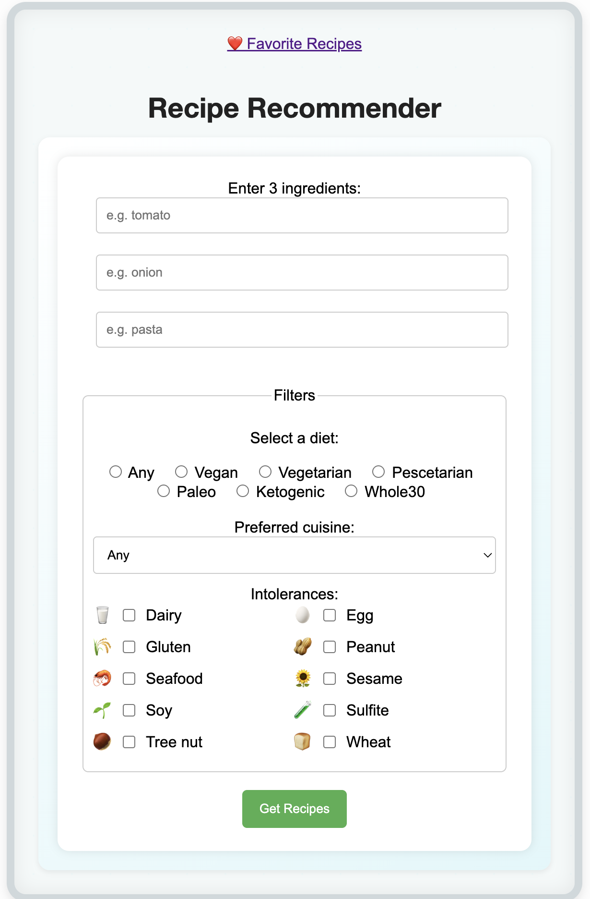

# Recipe Recommender – Smart Cooking From Your Fridge

This project started with a simple question: what if my fridge could help me decide what to cook? I wanted to build something real, not just a toy. So I made this. Sometimes, you open the fridge and have no idea what to cook. This app helps you solve that by suggesting recipes based on what you actually have in your kitchen.

Here’s how it works: you enter three ingredients you have on hand, choose your diet preferences (like vegan or not), select any food allergies or intolerances you have, and pick your favorite cooking style or cuisine. The app then talks to the Spoonacular API to find recipes that match your inputs.

One cool feature is real-time spell checking and correction for your ingredients, so you don’t have to worry about typos messing up your search.

The app fetches a list of recipes and ranks them by how many ingredients you already have, making it easier for you to cook without extra shopping.

## How to install and run

### Prerequisites:
- Python 3.7+
- API Key from [Spoonacular](https://spoonacular.com/food-api)

1. Clone the repository:
   ```
   git clone https://github.com/yourusername/recipe-recommender.git
   cd recipe-recommender
   ```

2. Create and activate a virtual environment:
   ```
   python3 -m venv venv
   source venv/bin/activate    # On Windows: venv\Scripts\activate
   ```

3. Install the dependencies:
   ```
   pip install -r requirements.txt
   ```

4. Create a `.env` file in the project folder and add your Spoonacular API key:
   ```
   SPOONACULAR_API_KEY=your_api_key_here
   ```

5. Run the app:
   ```
   python app.py
   ```

6. Open your browser and go to [http://127.0.0.1:5000](http://127.0.0.1:5000)

## 🖼️ Screenshot

Here’s how the app looks when running locally:




## What’s next?

- Connecting the app directly to your smart fridge to automatically know what’s inside  
- Using your phone camera to scan ingredients and add them to your list  
- Smarter ingredient recognition with Hebrew and English support  
- Personalized recipe recommendations based on your cooking habits  
- Exporting shopping lists for missing ingredients

This project is a step towards making home cooking simpler and more fun for everyone. Enjoy cooking!

---
*Built as part of the Python Course at the Weizmann Institute of Science (2025), under the guidance of [Gabor Szabo](https://https://github.com/szabgab).*